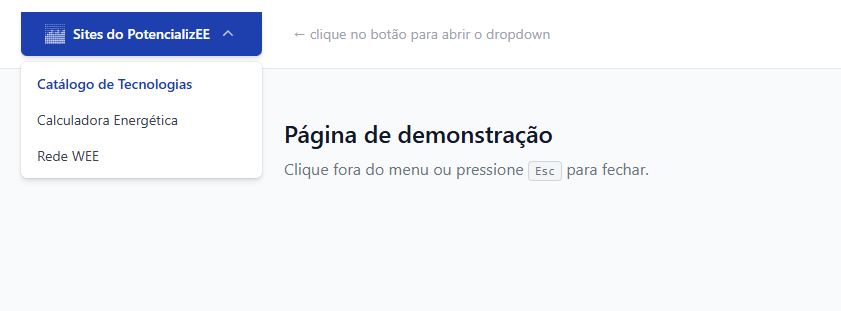

# Menu Sites do PotencializEE

> Componente de menu dropdown reutilizável para uso nos produtos digitais do Programa PotencializEE.  
> Disponível em duas versões: **CSS puro** e **Tailwind CSS**. Use a versão que for mais conveniente como base para implementar o menu em seu projeto.

---

## Preview



---

## Versões disponíveis

| Versão     | Localização       | Dependências          |
|------------|-------------------|-----------------------|
| CSS puro   | `css/`            | Nenhuma               |
| Tailwind   | `tailwind/`       | Tailwind CSS v3+      |

Ambas as versões usam **JS puro** (sem jQuery, Alpine.js ou similar). Você pode modificar o código ou substitui-lo totalmente para seguir o padrão adotado em seu projeto.
Recomendamos que o menu seja usado sempre no topo do layout, alinhado à direita. Você pode usar tanto a logo verde quanto a branca, disponíveis na pasta `images/`. 

---

## Instalação

1. Copie os arquivos da pasta correspondente (`css/` ou `tailwind/`) para o seu projeto.
2. Copie o snippet de `menu.html` para o seu layout.
3. Ajuste cores e tipografia conforme as seções abaixo.

---

## Como usar — CSS puro

### 1. Importe os arquivos

```html
<link rel="stylesheet" href="caminho/para/menu.css">
<script src="caminho/para/menu.js" defer></script>
```

### 2. Cole o HTML

Copie o conteúdo de `css/menu.html` para o seu layout.

### 3. Atualize os itens do menu

1. Adicione e/ou atualize os itens do menu conforme as orientações da equipe do Programa PotencializEE. Dica: dê uma olhada em como o menu foi implementado no site do PotencializEE.
2. Marque o link ativo/atual com a classe `--org-nav-link-active-color`. Este deve ser o link da plataforma/site onde está implementado o menu.

### Variáveis disponíveis

| Variável                          | Padrão                          | Descrição                        |
|-----------------------------------|---------------------------------|----------------------------------|
| `--org-nav-bg`                    | `#ffffff`                       | Cor de fundo do nav              |
| `--org-nav-border`                | `#e5e7eb`                       | Cor da borda inferior            |
| `--org-nav-link-color`            | `#374151`                       | Cor dos links                    |
| `--org-nav-link-hover-color`      | `#111827`                       | Cor dos links no hover           |
| `--org-nav-link-active-color`     | `#2563eb`                       | Cor do link ativo/atual          |
| `--org-nav-dropdown-bg`           | `#ffffff`                       | Fundo do painel dropdown         |
| `--org-nav-dropdown-shadow`       | `0 4px 16px rgba(0,0,0,0.08)`   | Sombra do dropdown               |
| `--org-nav-height`                | `64px`                          | Altura do nav                    |
| `--org-nav-font-size`             | `0.9375rem`                     | Tamanho de fonte dos links       |
| `--org-nav-dropdown-border-radius`| `8px`                           | Raio de borda do dropdown        |

---

## Como usar — Tailwind CSS

### 1. Pré-requisito

Tailwind CSS v3+ instalado e configurado no projeto.

### 2. Cole o HTML

Copie o conteúdo de `tailwind/menu.html` para o seu layout.

### 3. Importe o JS

```html
<script src="caminho/para/tailwind/menu.js" defer></script>
```

### 3. Atualize os itens do menu

1. Adicione e/ou atualize os itens do menu conforme as orientações da equipe do Programa PotencializEE. Dica: dê uma olhada em como o menu foi implementado no site do PotencializEE.
2. Marque o link ativo/atual com a classe `--org-nav-link-active-color`. Este deve ser o link da plataforma/site onde está implementado o menu.

### Classes JS (não remover)

As classes prefixadas com `js-` são âncoras para o JavaScript e não devem ser removidas
do HTML. As classes visuais ao lado delas podem ser alteradas livremente.

| Classe              | Elemento                   | Função                              |
|---------------------|----------------------------|-------------------------------------|
| `js-dropdown-item`  | `<li>` pai do dropdown     | Identifica item com dropdown        |
| `js-dropdown`       | `<ul>` do dropdown         | Painel a ser aberto/fechado         |
| `js-chevron`        | `<svg>` da seta            | Rotacionado ao abrir                |
| `js-nav-toggle`     | `<button>` hambúrguer      | Abre/fecha menu mobile              |
| `js-nav-mobile`     | `<div>` menu mobile        | Container do menu mobile            |
| `js-icon-open`      | SVG hambúrguer             | Ícone do estado fechado             |
| `js-icon-close`     | SVG X                      | Ícone do estado aberto              |

---

## Acessibilidade

O componente foi estruturado seguindo as recomendações WCAG 2.1:

- Atributos `role="menubar"`, `role="menu"`, `role="menuitem"` corretos
- `aria-haspopup="true"` e `aria-expanded` atualizados dinamicamente via JS
- `aria-current="page"` no item ativo
- Fechamento com tecla **Esc**
- Atributo `aria-label` no botão de toggle atualizado ao abrir/fechar